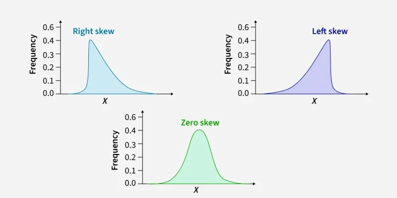

# Statistics 

Statistics is the science of collecting, organizing, analyzing, interpreting, and presenting data to turn it into useful information

**Importance of stats in ML**
- Understand the data 
- Choose the right algorithms
- Evaluate model accuracy and performance
- Handle uncertainty and variability in real-world data

**Applications**
- Feature Engineering: selecting and transforming useful variables.
- Image Processing: analyzing patterns, shapes and textures.
- Anomaly Detection: spotting fraud or equipment failures.

## Type of statistics

1) Descriptive : Descriptive statistics simplify and summarize data sets, making them easier to understand through numerical measures and graphical representations

    - Measures of Central Tendency: Describe the center of data (mean, median, mode).
    - Measures of Dispersion/Variability: Describe the spread of data (range, variance, standard deviation).
    - Graphical Representation: Histograms, bar charts, and pie charts to visualize distributions

2) Inferential : It uses smaller data to draw conclusions about a larger group. It helps us predict and draw conclusions about a population.

## Descriptive
### Measure of Central Tendency (Mean, Median, Mode)

**1) Mean**:

    The mean in statistics is the numerical average of a data set, calculated by summing all values and dividing by the total number of values.

- Advantage: Uses every data point in the calculation, making it robust for normal distributions.
- Disadvantage: Heavily influenced by extreme outliers (e.g., in a salary dataset with one billionaire, the mean is not representative)

**2) Median**

    The median is the middle value in an ordered dataset, separating the higher half from the lower half.

- Advantage : Unlike mean do not get affected by outliers making it ideal for skewed data like income or property cost
- Disadvantage : sorting observations for large data sets consume time and only consider middle not values other point

**3) Mode**

    The mode is the value that appears most frequently in a dataset, representing the most common item or "popular choice"

- Advantage : Can be used for non numerical data, better for identifing preffered item as use frequency rather than middle item
- Disadvanteg: Sometimes do not present and not not always unique as two or more item can have same frequency.

### Measures of Dispersion/Variability (Range, variance, standard deviation, interquartile range)

**Note: Dispersion in statistics measures how spread out or scattered data points are around a central value **

**1) Range** 
    It is spread of data and calculated by subtracting the minimum value from the maximum value.

- Advantage : Easy to compute
- Disadvantage : Highly afftected by outliers

**2) Variance**
    Variance statistics measures how far a set of numbers are spread out from their average (mean) value. Calculated as the average of squared deviations from the mean.

- Advantage : Takes account of every data point in a dataset, providing a complete picture of dispersion.
- Disadvantage : less robust and outliers can heavily ditort result

**3) Standard Deviation**
    Standard Deviation (SD) is a statistic measuring the amount of variation or dispersion of a set of data values from its mean. A low SD indicates data points are close to the mean, while a high SD shows wider spread

- Also gets affected by outliers

**4) Interquartile range**
    The range between the first and third quartiles, measuring data spread around the median.

- Advantage : Unaffected by outliers
- Disadvantage : Ignores top 25% and bottom 25% of data 

### Measures of Shape (Skewness, Kurtosis)

**1 ) Skewness** 

    Skewness statistics measure the asymmetry of a probability distribution around its mean, indicating if data points cluster more on one side (positive/right or negative/left) rather than following a symmetric normal distribution (0 skew)

**Types of Skewness**
- Positive Skew (Right-skewed): Mean > Median, with a tail to the right.
- Negative Skew (Left-skewed): Mean < Median, with a tail to the left.
- Zero Skew: Symmetric (Normal Distribution).

**2) Kurtosis**

    Kurtosis is a statistical measure that quantifies the "tailedness" of a probability distribution, describing how often outliers occur relative to a normal distribution

    It highlights whether data has heavy tails (leptokurtic), light tails (platykurtic), or normal tails (mesokurtic), aiding in risk management, finance, and quality control by identifying extreme values. 

## Inferential

Inferential statistics uses sample data to draw conclusions, test hypotheses, and make predictions about a larger population